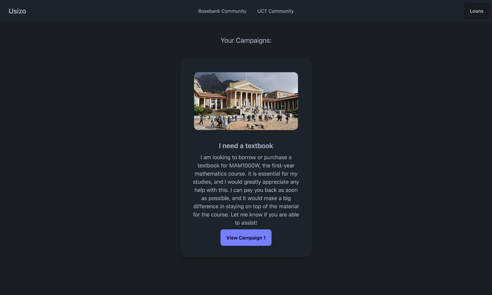
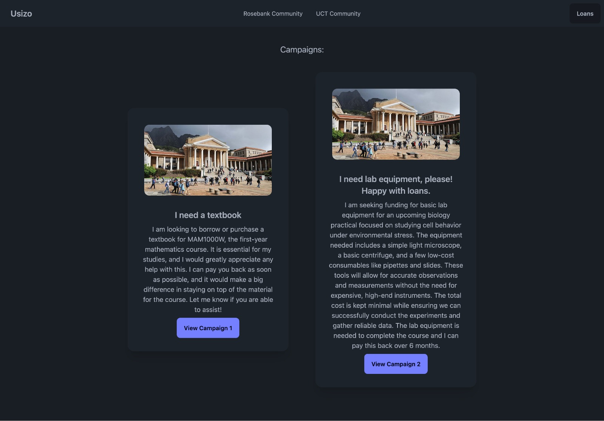
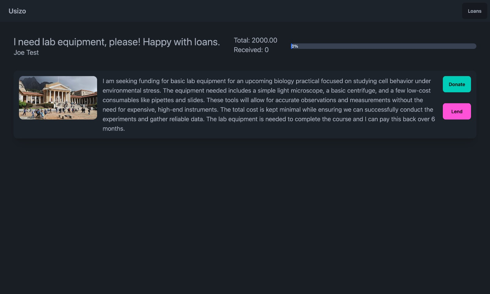
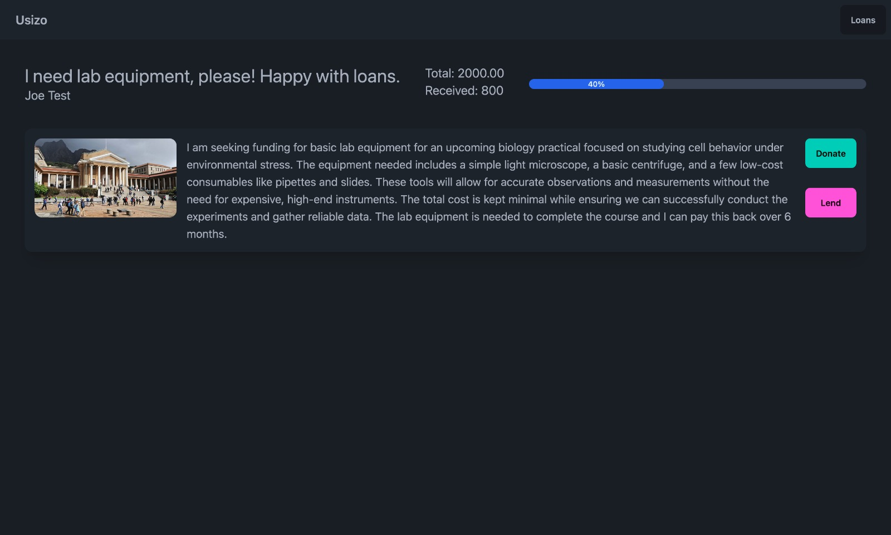
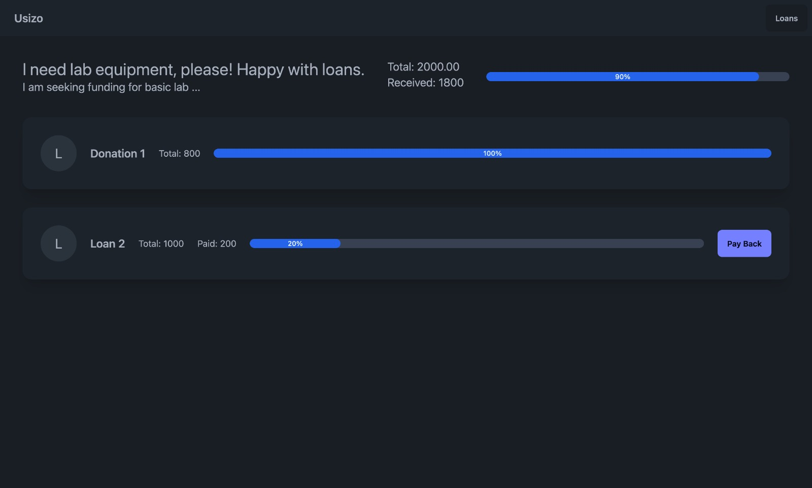
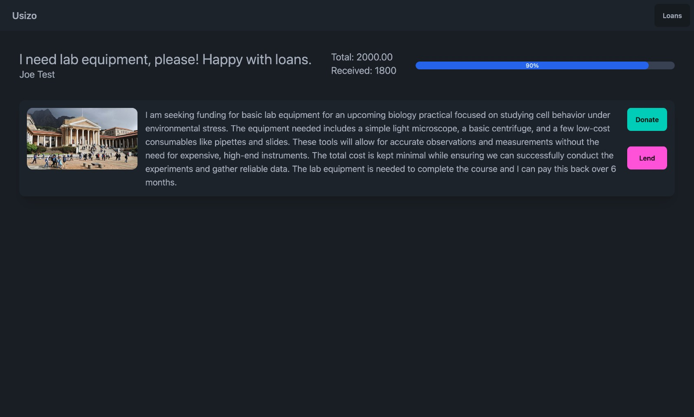
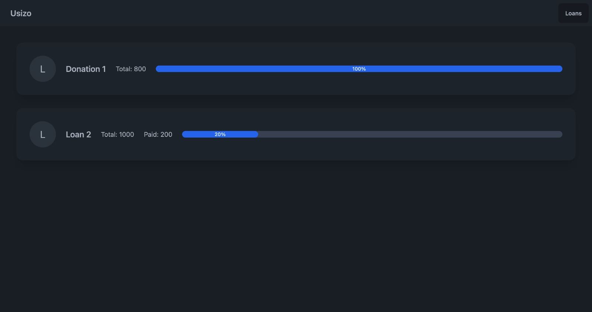

# Usizo

## Description

This is a webapp created for an overnight hackathon hosted by the Interledger Foundation. The app is intended to be used by communities to support individuals that need funds. Users can view requests in their communities and donate or loan money. The application uses the Open Payments API to support payments between users and use a TigerBeetle database to record transactions. Our team won the 2nd place award for teams that used a TigerBeetle database. Images at the bottom of this README show the UI.

## Setup/Configuration

Copy the `.env.example` file into a `.env` file in the project root, and customise the values according to your setup.

A network-accessible PostgreSQL server and a TigerBeetle server are required.

## Running

First make sure that `node` and `npm` are installed. Then run the following commands to install dependencies, start a development server and open the app.

```bash
npm install
npm run dev -- --open
```

NOTE: the server will reset the PostgreSQL database every time it is run, but it will not reset the contents of the TigerBeetle database (as this is not possible through its API). Please reset the TigerBeetle database by shutting down the server and deleting and recreating its data file before running the server again.

## Guide

* A user account is automatically added to the database with:
  * Username: luke.eberhard@gmail.com
  * Password: password
* The first page shown lists the campaigns belonging to the user, if any
* Any communities that they belong to will be listed in the navbar and can be navigated between
* All campaigns belonging to the community can be selected to view more information
* If the user is the creator of the campaign, they will see all the loans associated with it
* If not, the user will see the entire description and have the option to donate or lend

## Building

To create a production version of the app:

```bash
npm run build
```

You can preview the production build with `npm run preview`.

## Images









